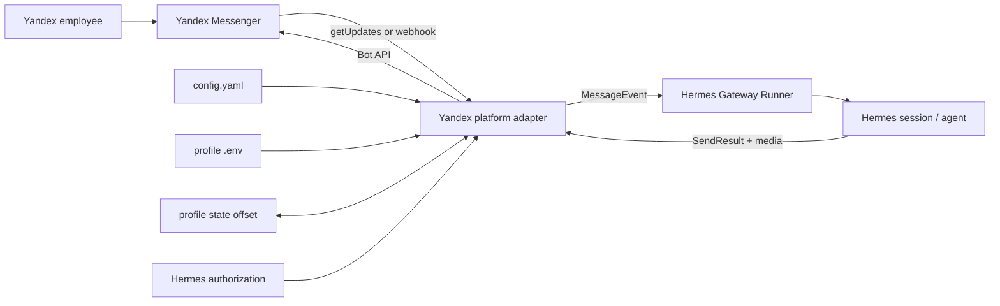

# Architecture

## Decision summary

The connector is a standalone Hermes `kind: platform` plugin. This is the
native extension point for a third-party messaging product and avoids both a
core fork and an MCP-shaped transport mismatch.



The detailed choices are in:

- [ADR-001: standalone platform plugin](adr/001-standalone-platform-plugin.md)
- [ADR-002: polling by default](adr/002-polling-default.md)
- [ADR-003: shared-chat activation boundary](adr/003-shared-chat-boundary.md)

## Hermes integration

`register(ctx)` contributes a dynamic platform named `yandex_messenger`.
Hermes' platform registry then supplies:

- adapter construction and lifecycle;
- config parsing for the dynamic `Platform` member;
- per-user authorization through `YANDEX_MESSENGER_ALLOWED_USERS`;
- profile-aware routing through `BasePlatformAdapter.build_source`;
- cron/detached sending;
- system-prompt platform guidance;
- gateway status/setup visibility;
- normal busy-session, approval, clarification, and command handling.

The adapter calls the public base-class token lock with the token as the
identity. This prevents two Hermes profiles/processes from consuming the same
bot's mutually exclusive update stream. The token is hashed by Hermes' lock
implementation; it is not placed in filenames or logs.

## Inbound mapping

Yandex `Update` maps to Hermes `MessageEvent` as follows:

| Yandex | Hermes |
|---|---|
| `update_id` | `platform_update_id` |
| `message_id` | `message_id` |
| `from.login` | `source.user_id` |
| `from.id` | `source.user_id_alt` and `metadata.yandex_sender_id` |
| private sender login | `source.chat_id = login:<login>` |
| group/channel `chat.id` | `source.chat_id = chat:<id>` |
| `chat.type=private` | `source.chat_type=dm` |
| `chat.type=group/channel` | corresponding Hermes chat type |
| `text` | event text |
| `images[][]` | largest variant per image, cached as photo |
| `file` | bounded download, cached as document |

Bot-authored (`from.robot=true`) updates are ignored to avoid loops.

Yandex says private chats have no meaningful chat ID. The counterpart login is
therefore the durable direct-message route. Prefixing target kinds eliminates
ambiguity for cron and cross-platform sends.

### Offset semantics

Polling begins at the stored `next_offset`, processes updates sequentially, and
atomically writes `max(update_id)+1` after each update has been accepted by the
Hermes base adapter. The file is:

```text
$HERMES_HOME/state/yandex_messenger_offset.json
```

This location is profile-local and survives repository upgrades. Yandex deletes
all pending updates below the offset supplied to `getUpdates`, so a single
consumer and durable offset are correctness requirements.

The HTTP API does not document long-poll parameters. The connector uses normal
poll requests, sleeps only after an empty response, and applies exponential
backoff with jitter after failures.

## Outbound mapping

Text uses `messages/sendText/` with a unique `payload_id` for Yandex-side
duplicate detection. Content is split at 5900 characters using Hermes'
code-fence-aware chunker, leaving headroom below the 6000-character limit.

Targets map to exactly one of `login` or `chat_id`. Replies use
`reply_message_id`; a numeric `metadata.thread_id` is forwarded when present.
Typing uses `messages/sendTyping/`. Hermes refreshes its one-shot indicator
frequently enough for Yandex's three-second typing timeout.

Images and files use multipart `sendImage/` and `sendFile/`. Yandex's upload
endpoints do not expose a caption field, so captions are sent as a following
text message.

Transient HTTP statuses (`408`, `425`, `429`, and `5xx`) and network failures
produce `SendResult.retryable=True`. `Retry-After`, when present, is preserved.
Error messages never contain the OAuth header.

## Native interactive controls

Yandex's current `SuggestButtons` and `server_action` directives are used
instead of the deprecated `inline_keyboard`.

For each prompt the adapter generates a random action ID and retains the real
Hermes session/prompt IDs only in bounded, expiring server-side memory. The
button payload contains only:

```json
{"action_id": "<random>", "choice": "<bounded-choice>"}
```

On callback, the adapter:

1. reads `bot_request.server_action`;
2. requires the expected action name;
3. finds unexpired server-side state;
4. re-runs Hermes authorization for the clicking sender;
5. resolves the appropriate Hermes approval/confirmation/clarification.

This prevents clients from forging a session key or arbitrary resolver value.
Callback state is process-local and expires after one hour; a gateway restart
turns old buttons into harmless no-ops. Users can still use Hermes' text
fallback commands.

## Webhook mode

Yandex specifies:

- the webhook body is identical to a `getUpdates` response;
- at-least-once delivery;
- ordering per bot+chat;
- 100 ms connect and 1 second read timeouts;
- `2xx` and `4xx` as terminal responses;
- retry on connection failure/`5xx`;
- deletion after 24 hours.

The endpoint therefore validates the JSON envelope, deduplicates recent
`update_id` values, schedules processing, and responds immediately.

Important tradeoff: once the connector returns `2xx`, the queued work is only
in process memory. A crash in that narrow post-ack window can lose the update.
Polling avoids this webhook-specific window and is the recommended mode.
A future durable webhook inbox would close it.

No signature header or HMAC scheme appears in Yandex's published webhook
contract as of the research date. The secret path is an explicit inference and
compensating control, not a Yandex-provided authenticity guarantee.

## Thread and mention limitations

`sendText`, `sendFile`, `sendImage`, and `sendTyping` document outbound
`thread_id`, but the published `Update` schema does not contain an inbound
thread field. The adapter forwards `thread_id` if a future/tenant response
contains one, but inbound thread continuity is not claimed.

Likewise, the Update schema has no mention entity. Group `mention` mode uses
text matching against the bot login and explicit aliases. Dedicated groups
should prefer `all`; security-sensitive shared groups should prefer `commands`.

## Dependency policy

The implementation uses `aiohttp`, already part of Hermes' messaging
dependencies. There is no unofficial Yandex SDK and no additional persistent
service. The diagnostic script uses only Python's standard library.
